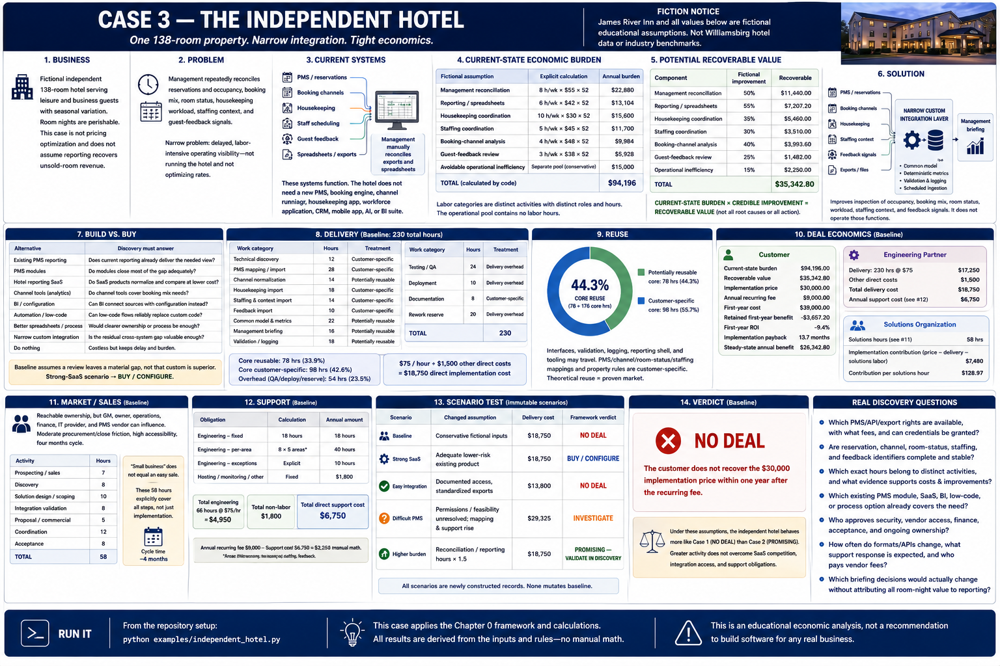

# Case 3 — The Independent Hotel



> **Fiction notice:** James River Inn, its 138 rooms, workflows, hours, costs, prices, percentages, and every operational or financial value below are fictional educational assumptions. They are not Williamsburg data, hotel benchmarks, market research, or financial advice.

**Core question:** Can one independent hotel create enough recoverable value to justify a narrow custom integration layer without replacing its PMS or reservation systems?

## 1. Business

James River Inn is a fictional single 138-room property serving leisure and business guests. It has direct and third-party bookings, housekeeping and front-desk teams, a small management team, and meaningful fictional seasonal variation. Room nights are perishable—tonight's unsold room cannot be sold tomorrow—but this case neither models dynamic pricing nor assumes reporting recovers unsold-room revenue.

## 2. Problem

Management repeatedly reconciles reservations and occupancy, booking mix, room status, housekeeping workload, staffing context, and guest-feedback signals. The narrow problem is delayed, labor-intensive operating visibility—not running the hotel and not optimizing rates.

## 3. Current systems

```text
PMS / reservations ───────┐
Booking channels ─────────┤
Housekeeping ─────────────┤
Staff scheduling ─────────┼──→ management manually reconciles
Guest feedback ───────────┤       exports and spreadsheets
Spreadsheets / exports ───┘
```

These systems function. The hotel does **not** need a new PMS, booking engine, channel manager, housekeeping app, workforce application, CRM, mobile app, recommendation engine, or AI review analysis.

## 4. Current-state economic burden

Each labor category is a distinct fictional activity/role allocation; the same reporting hour is not repeated elsewhere. The operational pool contains no labor hours.

| Fictional assumption | Explicit calculation | Annual burden |
|---|---:|---:|
| Management reconciliation | 8 h/week × $55 × 52 | $22,880 |
| Reporting/spreadsheets | 6 h/week × $42 × 52 | $13,104 |
| Housekeeping coordination | 10 h/week × $30 × 52 | $15,600 |
| Staffing coordination | 5 h/week × $45 × 52 | $11,700 |
| Booking-channel analysis | 4 h/week × $48 × 52 | $9,984 |
| Guest-feedback review | 3 h/week × $38 × 52 | $5,928 |
| Avoidable operational inefficiency | separate conservative fictional pool | $15,000 |
| **Total** | calculated by code | **$94,196** |

The $15,000 pool is deliberately separate and uncertain. It is not theoretical room revenue and is recovered at only 15% below.

## 5. Potential recoverable value

The model always uses `measurable burden × credible improvement`, never “better data equals all lost revenue.”

| Component | Fictional improvement | Recoverable |
|---|---:|---:|
| Management reconciliation | 50% | $11,440.00 |
| Reporting/spreadsheets | 55% | $7,207.20 |
| Housekeeping coordination | 35% | $5,460.00 |
| Staffing coordination | 30% | $3,510.00 |
| Booking-channel analysis | 40% | $3,993.60 |
| Guest-feedback review | 25% | $1,482.00 |
| Operational inefficiency | 15% | $2,250.00 |
| **Total** | | **$35,342.80** |

## 6. Solution

The smallest intervention imports PMS/reservation data, normalizes booking channels, imports housekeeping status, staffing context, and feedback signals, maps them to a common property/day model, calculates deterministic metrics, validates/logs failures, and emits a management briefing. It improves inspection of occupancy, booking mix, room status, workload, staffing context, and feedback signals; it does not operate those functions.

## 7. Build vs. buy

Discovery must compare (1) existing PMS reporting, (2) PMS modules, (3) hotel reporting SaaS, (4) channel tools, (5) BI/configuration, (6) automation/low-code, (7) better spreadsheets/process, (8) narrow custom integration, and (9) doing nothing. The baseline assumes a residual gap, not that custom is intrinsically superior. The strong-SaaS scenario selects **BUY / CONFIGURE**. Mature hotel software competition weakens the custom opportunity.

## 8. Delivery

The baseline models 230 total hours: 78 potentially reusable core hours, 98 property-specific core hours, 24 QA/testing, 10 deployment, and 20 rework reserve. At a fictional $75/hour plus $1,500 other direct costs, direct implementation cost is **$18,750**.

Work includes technical discovery; PMS mapping/import; channel normalization; housekeeping, staffing, and feedback imports; common model and metrics; briefing; validation/logging; tests; deployment; documentation; and reserve.

## 9. Reuse

Import framework, adapter interfaces, validation, logging, reporting shell, deployment tooling, and generic occupancy/booking concepts are potentially reusable. PMS/export/channel/room-status/staffing mappings and property reporting rules are customer-specific. Derived core reuse is **44.3%** (78 ÷ 176), but theoretical reuse does not prove a repeatable market.

## 10. Deal economics

The fictional implementation price is **$30,000** and recurring fee **$9,000**. First-year cost is $39,000; first-year retained benefit is **–$3,657.20**, first-year ROI is **–9.4%**, and payback is **13.7 months**. Direct delivery plus 58 solutions hours leaves **$7,480** implementation contribution, or **$128.97 per solutions hour**.

## 11. Market / sales

Ownership may be reachable, but the GM, owner, operations, finance, IT provider, and PMS vendor can all affect a decision. The baseline uses moderate procurement/close friction, high accessibility, and four months. Its 58 solutions hours explicitly cover prospecting, discovery, design, integration validation, proposal/scoping, coordination, and acceptance. “Small business” is not shorthand for an easy sale.

## 12. Support

The $9,000 recurring revenue is not profit. Sixty-six engineering hours cover monitoring, API/PMS and channel changes, changed exports, data quality, support, fixes, and maintenance; $1,800 covers fictional hosting/monitoring and other direct obligations. Direct recurring cost is **$6,750**, leaving **$2,250** recurring contribution.

## 13. Scenario test

All variants are newly constructed immutable records; none mutates baseline assumptions.

| Scenario | Changed assumption | Delivery cost | Framework verdict |
|---|---|---:|---|
| Baseline | conservative fictional inputs | $18,750 | NO DEAL |
| Strong SaaS | adequate lower-risk existing product | $18,750 | BUY / CONFIGURE |
| Easy integration | documented access, standardized exports | $13,800 | NO DEAL |
| Difficult PMS | permissions/feasibility unresolved; mapping/support rise | $29,325 | INVESTIGATE |
| Higher burden | reconciliation/reporting hours × 1.5 | $18,750 | PROMISING — VALIDATE IN DISCOVERY |

Easy access improves delivery contribution and reuse, but cannot repair the baseline customer's one-year value gate by itself. Difficult access demonstrates that an easy architecture diagram is not technical feasibility.

## 14. Verdict

The baseline verdict is **NO DEAL** because the customer does not recover the $30,000 implementation price within one year after the recurring fee. The answer is framework-derived rather than selected for the narrative.

The implemented-case calculation asks: **Does the independent hotel behave economically more like the single restaurant or the restaurant group?** Under these assumptions it resembles Case 1's **NO DEAL**, despite greater activity; Case 2 has $67,070 recoverable value and a promising baseline, while Case 1 has $10,392 and no deal. Hotel complexity, SaaS competition, integration access, and support offset its greater activity. A good property would still not prove a good independent-hotel market.

## Real discovery questions

- Which PMS/API/export rights are contractually available, at what fees, and can credentials be granted?
- Are reservation, channel, room-status, staffing, and feedback identifiers complete and stable?
- Which exact hours belong to distinct activities, and what evidence supports loaded costs and improvements?
- Which existing PMS module, SaaS, BI, low-code, or process option already covers the need?
- Who approves security, vendor access, finance, acceptance, and ongoing ownership?
- How often do formats/APIs change, what support response is expected, and who pays vendor fees?
- Which briefing decisions would actually change, without attributing all room-night value to reporting?

## Run it

```bash
python examples/independent_hotel.py
```

[Previous: Case 2](02-restaurant-group.md) · [Book home](../README.md) · [Next: Case 4](04-hotel-group.md)
