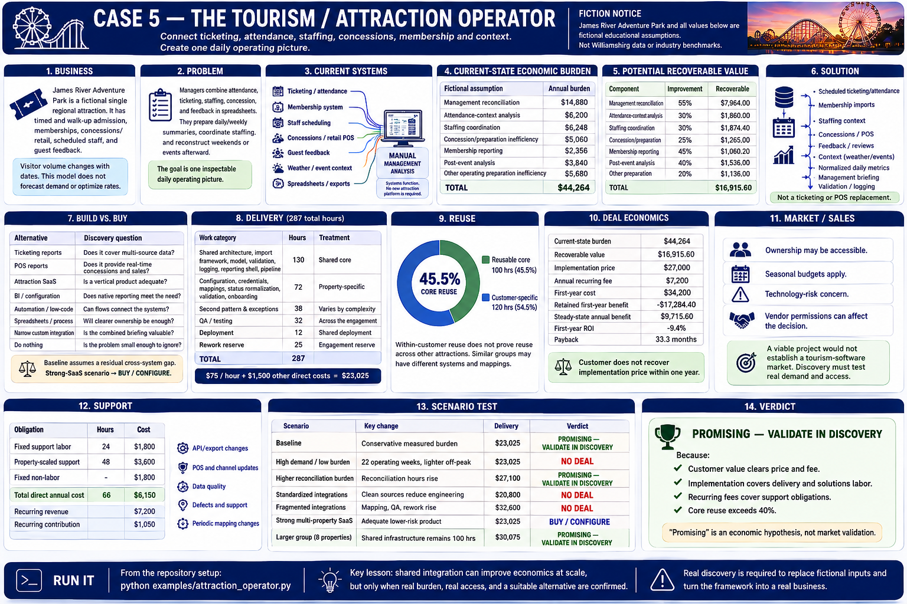

# Case 5 — The Tourism / Attraction Operator



> Every business, operating input, context flag, and financial value below is fictional and educational. Nothing is Williamsburg, Virginia, attraction-industry, or tourism-industry data or a benchmark.

**Core question:** Can connecting ticketing, attendance, staffing, concessions, membership, weather/event context, and guest feedback create enough recoverable value to justify a narrow custom integration?

## 1. Business

James River Adventure Park is a fictional single regional attraction, seasonal but open much of the year. It has timed and walk-up admission, memberships, concessions/retail, scheduled staff, several activity areas, and guest feedback. Visitor volume changes with dates; managers also inspect weather, holidays, school breaks, and local events.

The modeled year has **18 peak weeks and 26 non-peak weeks**. That split is an assumption, not a forecast. A peak-week headache does not automatically create enough annual value.

## 2. Problem

Managers combine attendance, ticketing, staffing, concession, membership, feedback, and contextual exports by hand. They prepare daily/weekly summaries, coordinate staffing with fragmented evidence, review concession preparation, and reconstruct weekends or events afterward. The missing artifact is one inspectable daily operating picture.

The opportunity is **connect evidence → reduce reconciliation → improve visibility**. It is not a perfect-attendance forecaster.

## 3. Current systems

```text
Ticketing / attendance ──────┐
Membership system ───────────┤
Staff scheduling ────────────┤
Concessions / retail POS ────┼──> manual management analysis
Guest feedback ──────────────┤
Weather / event context ─────┤
Spreadsheets / exports ──────┘
```

These systems function and do not need replacement. The executable uses only deterministic fictional context (`weather_condition`, `holiday_flag`, `local_event_flag`, and `school_break_flag`); it calls no weather or event service and creates no prediction score.

## 4. Current-state economic burden

Each row is `peak weekly units × 18 + non-peak weekly units × 26`, then multiplied by a loaded cost. Labor units are hours. The two dollar-denominated inefficiencies are separate fictional observations, not revenue loss, and are kept distinct to avoid double counting.

| Component | Peak / non-peak assumption | Annual burden |
|---|---:|---:|
| Management reconciliation | 10h / 5h at $48 | $14,880 |
| Attendance-context analysis | 4h / 2h at $50 | $6,200 |
| Staffing coordination | 5h / 2h at $44 | $6,248 |
| Concession/preparation inefficiency | $180 / $70 | $5,060 |
| Membership reporting | 2h / 1h at $38 | $2,356 |
| Post-event analysis | 3h / 1h at $48 | $3,840 |
| Other operating preparation inefficiency | $200 / $80 | $5,680 |
| **Total** | | **$44,264** |

Seasonality is visible in every formula. Scenario B reduces the operating year to 12 peak and 10 non-peak weeks and halves non-peak intensity; it does not pretend peak pain lasts 52 weeks.

## 5. Potential recoverable value

Recovery is burden times an explicit improvement rate: 55% reconciliation, 30% attendance-context analysis, 30% staffing coordination, 25% concessions/preparation, 45% membership reporting, 40% post-event analysis, and 20% other preparation. The result is **$16,915.60 annually**.

No revenue benefit appears in the baseline. Scenario G separately adds a fictional **$8,000 uncertain upside** so its influence remains obvious; it is a hypothesis about better preparation, not a forecast.

## 6. Solution

The smallest intervention is scheduled ticketing/attendance, membership, staffing, concessions/POS, feedback, and static context imports; adapter validation and logging; normalized date/location/activity records; deterministic daily metrics; and a management briefing.

It is not ticketing, reservations, POS, scheduling, membership, CRM, a mobile app, a recommendation engine, a forecasting product, or an attraction-management suite.

## 7. Build vs. buy

The comparison includes ticketing reports, POS reports, attraction/venue SaaS, BI/configuration, low-code automation, better spreadsheets/procedures, narrow custom integration, and doing nothing. Vertical software could solve enough of the need with less cost and risk. Scenario F therefore returns **Buy / configure**; disconnection alone is not a reason to force custom software to win.

## 8. Delivery

Baseline delivery models 100 reusable core hours, 120 attraction-specific hours, 30 QA hours, 12 deployment hours, and a 25-hour rework reserve: **287 hours** total. At a fictional $75 direct hourly cost plus $1,500 other direct cost, delivery costs **$23,025**.

Discovery, ticketing, membership, staffing, POS, feedback/context adapters, normalization, the daily model, briefing, validation, testing, deployment, documentation, and reserve are all represented. Clean standardized sources reduce delivery; inconsistent identifiers and poor exports increase delivery and support.

## 9. Reuse

The potentially reusable 100 hours cover the import framework, adapter interfaces, validation/logging, date normalization, reporting shell, deployment tooling, and generic daily-summary patterns. The 120 customer-specific hours cover ticketing and concession mappings, activities, membership rules, staffing mappings, event definitions, and metrics. Derived core reuse is **45.5%**, not an asserted marketing percentage.

Similarity among restaurant groups, hotel groups, and attractions is a hypothesis about operational structure: multiple systems, daily decisions, staffing, variable demand, and management reporting. Five cases do not yet prove cross-customer reuse.

## 10. Deal economics

The fictional implementation price is **$27,000**, annual fee **$7,200**, and first-year cost **$34,200**. Recoverable value less the recurring fee is $9,715.60; first-year retained benefit is -$17,284.40. Payback is 33.3 months and first-year ROI is negative.

Solutions work is 50 hours: prospecting 6; discovery 6; workflow interviews 8; design 7; validation 8; proposal/scoping 5; coordination 6; acceptance 4. After $23,025 delivery cost and $3,250 solutions labor, implementation contribution is **$725**, or **$14.50 per solutions hour**.

## 11. Market / sales

Management may be accessible and the decision group small. Yet seasonal budgets, technology-risk concern, vendor permissions, and dependence on ticketing/POS providers create caution. “Local business” does not mean “easy sale.” A viable project would not establish a tourism-software market.

Discovery must learn how common these system combinations are, whether pain remains after native reporting, which integrations are accessible, what vertical SaaS provides, how much burden is measurable, who owns the decision, and whether workflows repeat enough for reuse.

## 12. Support

The annual fee is not pure profit. Baseline support includes 58 hours at $75 plus $1,800 for hosting/monitoring and other obligations: **$6,150 direct annual cost** and **$1,050 recurring contribution**. The obligations include API/export and POS changes, context maintenance, data quality, defects, support, and periodic mapping changes.

## 13. Scenario test

Scenarios are frozen, deterministic records; each builder returns a fresh value.

| Scenario | What changes | Framework result |
|---|---|---|
| A — Baseline | Conservative measured burden | **No deal** |
| B — High seasonality / low burden | 22 operating weeks and lighter off-peak work | **No deal** |
| C — High reconciliation burden | Explicit reconciliation hours rise | **Promising** |
| D — Standardized integrations | Clean sources reduce engineering/support | **No deal** (customer value gate still fails) |
| E — Fragmented integrations | Mapping, QA, rework, and support rise | **No deal** |
| F — Strong vertical SaaS | Adequate lower-risk alternative | **Buy / configure** |
| G — Uncertain revenue upside | Adds $8,000 outside baseline | **No deal** |

Standardization improves delivery economics but cannot manufacture customer value. High burden changes the answer only because a measurable assumption changes. The upside is intentionally insufficient to disguise the baseline.

## 14. Verdict

**NO DEAL** under baseline assumptions.

Exact framework reason: **The customer does not recover implementation price within one year.** Delivery contribution and recurring support remain positive, and core reuse exceeds 40%, but those facts do not bypass customer payback.

Is this attractive because tourism operations are complex, or only because we modeled a large burden? Baseline answers the question: complexity alone is insufficient. Only measurable burden + credible recovery + manageable delivery + an insufficient SaaS alternative can support custom work. Case C illustrates sensitivity; it is not evidence that its larger burden exists in the market.

---

[← Previous: Case 4 — The Small Hotel Group](04-hotel-group.md) · [Book home](../README.md) · [Next: Case 6 — The Multi-Location Retailer →](06-multi-location-retail.md)
