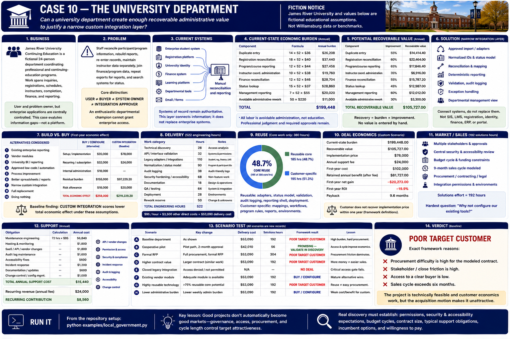

# Case 10 — The University Department



> **Fiction notice:** James River University and its Continuing Education Department are completely fictional and have no relationship to any real university. Every person, system, operational assumption, and financial figure below is invented for education. They are not benchmarks, legal advice, or compliance advice.

## 1. Business

James River University Continuing Education is a fictional 24-person department coordinating professional and continuing-education programs. Its work spans inquiries, registrations, schedules, instructors, completion, finance, and reporting:

```text
INQUIRY → PROGRAM / COURSE → REGISTRATION → PARTICIPANT RECORD
        → SCHEDULE → INSTRUCTOR / DELIVERY → COMPLETION → FINANCE / REPORTING
```

The department is the **user and problem owner**, but enterprise applications are centrally controlled. The executable evaluates the information gaps; it builds no education platform and handles no real student or institutional data.

## 2. Problem

Staff reconcile participant/program information, rebuild course reports, re-enter records, maintain instructor data separately, join finance and program data, repeat exports for management reports, and search several systems for ordinary status questions. Educational work, instructor judgment, enrollment, retention, tuition, and learning outcomes are not claimed as software-recoverable value.

The core distinction is:

```text
USER OF THE SOLUTION ≠ BUYER ≠ SYSTEM OWNER ≠ INTEGRATION APPROVER
CUSTOMER DESIRE ≠ EXECUTABLE DEAL
```

An enthusiastic departmental champion cannot grant enterprise access.

## 3. Current systems

```text
Enterprise student system ─────┐
Registration platform ─────────┤
University identity ───────────┤
Finance system ────────────────┼──→ departmental spreadsheets and manual reconciliation
Learning platform ─────────────┤
Departmental tools ────────────┤
Email / forms ─────────────────┘
```

### Authority map

| Role | Fictional baseline owner |
|---|---|
| Problem owner | Continuing Education Department |
| Budget owner | Department / school administration |
| System owner | Central IT / enterprise application owners |
| Data owner | James River University |
| Security approver | Central security |
| Integration approver | Central IT and system owners |
| Procurement | Institutional purchasing |
| End users | Department staff |

Buyer authority is **moderate**, departmental system control is **low**, and integration-approval difficulty is **high**. Baseline assumes approval is eventually obtained; it does not assume the department can self-authorize. Implementation requires central IT approval + data access + security review + procurement + vendor approval.

**REACHABLE USER ≠ REACHABLE BUYER**, and **REACHABLE BUYER ≠ AUTHORIZED SYSTEM OWNER**. A smaller owner-controlled business might be a better target despite lower theoretical value; that is a discovery hypothesis for these fictional cases, not a general market claim.

## 4. Current-state economic burden

All labor is avoidable administration, not education. Weekly components use `weekly hours × 52 × loaded hourly cost`; rework uses `incidents × cost per incident`.

| Component | Explicit formula | Annual burden |
|---|---:|---:|
| Duplicate entry | 14 × 52 × $36 | $26,208 |
| Registration reconciliation | 18 × 52 × $40 | $37,440 |
| Program/course reporting | 12 × 52 × $44 | $27,456 |
| Instructor coordination administration | 10 × 52 × $38 | $19,760 |
| Finance reconciliation | 12 × 52 × $46 | $28,704 |
| Status lookup | 15 × 52 × $37 | $28,860 |
| Management reporting | 7 × 52 × $55 | $20,020 |
| Avoidable administrative rework | 50 × $220 | $11,000 |
| **Total** | | **$199,448** |

## 5. Potential recoverable value

Recovery is burden multiplied by an explicit improvement rate: duplicate entry 55% = $14,414.40; registration reconciliation 60% = $22,464; program reporting 65% = $17,846.40; instructor administration 35% = $6,916; finance reconciliation 55% = $15,787.20; status lookup 45% = $12,987; management reporting 60% = $12,012; and rework 30% = $3,300. Total modeled recovery is **$105,727**.

No revenue or educational-outcome scenario is hidden in the baseline.

## 6. Solution

The smallest intervention ingests **approved** exports/APIs, normalizes program and participant identifiers, reconciles courses, maps finance/report fields, performs deterministic status/report calculations and validation, maintains audit-friendly logs, reports exceptions, and supplies a departmental management briefing.

```text
APPROVED SYSTEM EXPORTS / APIs → CUSTOM INTEGRATION LAYER
    → normalized departmental view → workflow / reporting / exceptions
```

Enterprise systems remain authoritative. This is not an SIS, LMS, registration platform, identity system, finance system, CRM, advising system, ERP, or portal.

## 7. Build vs. buy

The case compares (1) enterprise reporting, (2) vendor modules, (3) university BI, (4) approved low-code, (5) process improvement, (6) better spreadsheets/reports, (7) narrow custom integration, (8) full replacement, and (9) doing nothing. Baseline's fictional first-year economics favor narrow custom, but that does not remove authority friction. Scenario E makes a licensed BI tool adequate and returns **BUY / CONFIGURE**.

An unofficial app based on unauthorized access or unsupported shadow IT is explicitly rejected. If permissions fail, reduce scope or pass.

## 8. Delivery

Technical discovery is 26 hours; access validation 34; approved export/API integration 66; identity mapping 38; program normalization 42; finance mapping 36; validation 30; audit logging 28; security 38; accessibility 20; testing 58; deployment constraints 30; documentation 20; acceptance 14; and rework reserve 48. Total engineering is **528 hours**, including **92 hours** explicitly identified as access/security/accessibility effort.

At $95 internal cost plus $4,000 direct costs, delivery costs **$54,160**. The integration is technically modest relative to an enterprise replacement, but institutional constraints are real delivery work.

## 9. Reuse

Adapters, normalized entity patterns, validation, audit logging, reporting shells, and deployment patterns can recur. Institution-specific systems, program definitions, finance maps, governance, approvals, security environments, and reports do not automatically recur. Baseline models 178 of 392 core hours reusable (45.4%).

```text
REUSABLE CODE ≠ REUSABLE APPROVAL PROCESS
```

Scenario G raises technical reuse above 75% while governance remains unique; its target verdict remains poor.

## 10. Deal economics

Implementation price is **$78,000** and annual fee is **$24,000**. Annual net customer benefit is $81,727, so the framework's one-year payback gate passes. Delivery plus 208 solutions hours at $80 leaves **$7,200 contribution**, or **$34.62 per solutions hour**.

These numbers explain why a valuable, feasible project may still be an unattractive target.

## 11. Market / sales

Solutions work comprises prospecting 16, department discovery 18, stakeholder mapping 16, central IT coordination 28, system-owner meetings 20, access validation 18, security documentation 18, procurement support 26, proposal/scoping 16, design 14, acceptance 10, and other coordination 8: **208 hours**. Baseline also assumes a ten-month cycle, high procurement and close friction, and low access to a clear authorized buyer.

The departmental champion is not presumed to be the authorized buyer or approver. A centrally sponsored engagement can be a good project; that alone does not prove department-led university integrations are a repeatable market.

## 12. Support

Support includes 105 engineering hours at $95 plus restricted hosting $1,800, monitoring $1,200, export/API changes $1,800, identity changes $900, security updates $1,400, accessibility fixes $700, reporting-rule changes $900, user support $800, documentation $500, and change-control coordination $900. Annual cost is **$20,875**, leaving **$3,125** contribution.

## 13. Scenario test

Factories return new frozen records; no scenario mutates baseline.

| Scenario | Framework result | Lesson |
|---|---|---|
| A — Baseline university department | **POOR TARGET CUSTOMER** | Meaningful recovery and feasible delivery do not overcome fragmented authority and a difficult motion. |
| B — Centrally sponsored | **PROMISING — VALIDATE IN DISCOVERY** | Clear budget, approved access, central IT support, and a known procurement path reduce governance work. |
| C — Department-only champion | **NO DEAL** | Feasibility remains technically feasible, but approval is absent and modeled coordination makes economics fail; enthusiasm cannot authorize access. |
| D — Approved exports only | **PROMISING — VALIDATE IN DISCOVERY** | Stable read-only exports rescue a smaller solution without write access. Reduce scope before violating governance. |
| E — Existing university BI | **BUY / CONFIGURE** | A licensed supported tool solves most reporting at lower cost/risk. |
| F — Higher contract value | **POOR TARGET CUSTOMER** | $81,000 improves contribution, but the difficult institutional motion remains. |
| G — High technical reuse, unique governance | **POOR TARGET CUSTOMER** | Reusable code cannot reuse institutional approvals. |

### Case 9 vs. Case 10

Calculated Case 9 has 192 solutions hours, a nine-month cycle, high permission difficulty, and **POOR TARGET CUSTOMER**. Case 10 has 208 hours, a ten-month cycle, high permission difficulty, and the same category. Case 9 emphasizes procurement, security/accessibility, legacy integration, and formal approvals. Case 10 retains those frictions and adds central IT, distributed authority, institutional governance, and a department that does not own required systems.

In these assumptions, lack of control over delivery-critical systems is the larger obstacle: difficult procurement can eventually purchase an executable design, but purchasing authority alone cannot grant system access. This comparison is a fictional hypothesis to validate, not a universal conclusion.

The implemented-case comparison now covers Cases 1–10 and shows recoverable value, engineering hours/difficulty, reuse, procurement difficulty, and framework verdict separately—never a composite score.

## 14. Verdict

**POOR TARGET CUSTOMER.** Exact framework reasons are:

- Procurement difficulty is high for the modeled contract.
- Stakeholder and close friction is high for the modeled contract.
- Access to a clear buyer is low for the modeled contract.
- The modeled sales cycle exceeds six months and consumes scarce solutions capacity.

The person with the problem may not control the solution. Authority fragmentation belongs in opportunity analysis. Governance must not be bypassed. Smaller approved scope can rescue an opportunity. A large institution can be a poor target for a small engagement.

Real discovery must determine who owns budgets and systems, who can approve integrations, central IT policy, available institutional tools, purchasing thresholds, data governance, security review, usual contract size, real cycle length, and whether the same unresolved departmental need repeats across institutions. Until then, a good centrally sponsored project is not evidence of a good market.

---

[← Previous: Case 9 — The Local Government Department](09-local-government.md) · [Book home](../README.md) · [Next: Case 11 — The Healthcare Organization →](11-healthcare.md)
