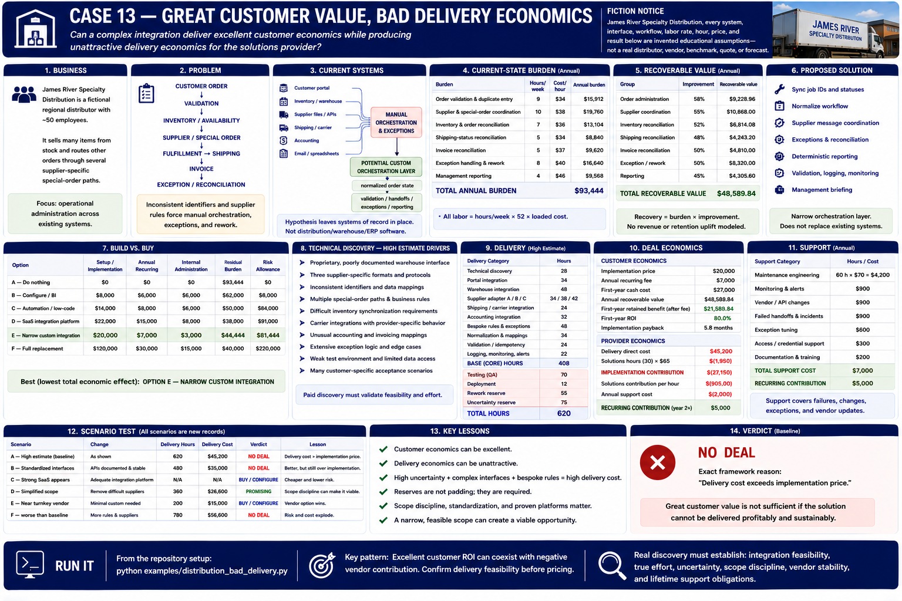

# Case 13 — Great Customer Value, Bad Delivery Economics

[← Previous: Case 12 — The Perfect-Looking Deal That Isn't](12-buy-dont-build.md) · [Book home](../README.md) · [Next: Case 14 — Great Product, Bad Sales Motion →](14-bad-sales-motion.md)



> **Fiction notice:** James River Specialty Distribution, every system, interface, workflow, labor rate, hour, price, and result below are invented educational assumptions—not a real distributor, vendor, benchmark, quote, or forecast.

## 1. Business

James River Specialty Distribution is a fictional regional distributor with approximately 50 employees. Customer orders may be filled from stock or routed through several supplier-specific special-order paths.

## 2. Problem

```text
CUSTOMER ORDER → VALIDATION → INVENTORY / AVAILABILITY
       → SUPPLIER / SPECIAL ORDER → FULFILLMENT → SHIPPING
       → INVOICE → EXCEPTION / RECONCILIATION
```

Inconsistent identifiers and unusual customer-specific rules force staff to orchestrate handoffs and exceptions manually. The question is only whether the opportunity is economically deliverable; this case does not build distribution, warehouse, ERP, order-management, or shipping software.

## 3. Current systems

```text
Customer portal ────────────┐
Inventory / warehouse ──────┤
Supplier files / APIs ──────┤
Shipping / carrier ─────────┼──→ manual orchestration / exceptions
Accounting ─────────────────┤
Email / spreadsheets ───────┘

Potential: those systems → CUSTOM ORCHESTRATION LAYER
                              ↓ normalized order state
                     validation / handoffs / exceptions
```

## 4. Current-state burden

Every burden is `hours/week × 52 × fictional loaded hourly cost`.

| Burden | Hours/week | Cost/hour | Annual burden |
|---|---:|---:|---:|
| Order validation and duplicate entry | 9 | $34 | $15,912 |
| Supplier and special-order coordination | 10 | $38 | $19,760 |
| Inventory and order reconciliation | 7 | $36 | $13,104 |
| Shipping-status reconciliation | 5 | $34 | $8,840 |
| Invoice reconciliation | 5 | $37 | $9,620 |
| Exception handling and avoidable rework | 8 | $40 | $16,640 |
| Management reporting | 4 | $46 | $9,568 |
| **Total** | | | **$93,444** |

## 5. Recoverable value

Recoverable value is each measured burden multiplied by a conservative improvement assumption—not all burden is claimed.

| Group | Improvement | Recoverable value |
|---|---:|---:|
| Order administration | 58% | $9,228.96 |
| Supplier coordination | 55% | $10,868.00 |
| Inventory reconciliation | 52% | $6,814.08 |
| Shipping reconciliation | 48% | $4,243.20 |
| Invoice reconciliation | 50% | $4,810.00 |
| Exception/rework | 50% | $8,320.00 |
| Reporting | 45% | $4,305.60 |
| **Total** | | **$48,589.84/year** |

At a $20,000 implementation and $7,000 recurring fee, first-year retained benefit is **$21,589.84**, first-year ROI is **80.0%**, and implementation payback is **5.8 months**. Customer economics are genuinely attractive.

## 6. Proposed solution

A narrow orchestration layer would normalize order state, validate handoffs, coordinate supplier messages, expose exceptions, and reconcile status. It would not replace the existing operational systems.

## 7. Build vs. buy

Fictional discovery considers SaaS, configuration, automation tooling, process/spreadsheet changes, custom integration, and doing nothing. Unlike Case 12, it finds no supported product that adequately handles the combined supplier formats, identifiers, mappings, special-order logic, and exception rules. The custom need is real; no speculative revenue uplift is included.

## 8. Technical discovery

The high estimate has causes, not just duration: a poorly documented proprietary warehouse interface; three supplier-specific formats; inconsistent identifiers; multiple special-order paths; difficult inventory synchronization; carrier-specific behavior; unusual accounting mappings; extensive exception logic; a weak test environment; and many customer-specific acceptance and reconciliation cases.

Paid discovery should answer:

1. Which interfaces are supported, documented, permissioned, versioned, and testable?
2. Who owns identifier and supplier-data normalization?
3. Which special-order and exception paths are required at launch?
4. What idempotency, rollback, reconciliation, and acceptance evidence is required?
5. Can approved CSV, read-only access, or a retained manual path replace a write integration?
6. Who owns monitoring, incidents, vendor changes, and support?

## 9. Delivery

Base work is 408 hours: technical discovery 28; portal 34; warehouse 48; supplier adapters 34/38/42; shipping 24; accounting 32; bespoke rules/exceptions 48; normalization 34; validation/idempotency 24; and logging/monitoring 22. Add 70 testing hours, 12 deployment hours, 55 rework-reserve hours, and 75 uncertainty-reserve hours: **620 total hours**.

At the fictional $70 direct engineering cost plus $1,800 other direct cost, delivery costs **$45,200**. Thus:

```text
IMPLEMENTATION CONTRIBUTION
= implementation revenue − direct implementation cost
= $20,000 − $45,200
= −$25,200
```

Solutions labor makes the full engagement contribution still worse. Attractive customer ROI does not override this ordered framework gate.

## 10. Reuse

The 80 reusable core hours cover generic normalization, validation/idempotency, logging, and monitoring. The 328 customer-specific hours cover discovery, supplier formats, portal and inventory behavior, mappings, special-order logic, and acceptance cases: **19.6% reusable / 80.4% customer-specific**. Future hypothetical reuse is neither current revenue nor demonstrated reuse; it cannot subsidize the baseline unless separately approved as strategic investment outside normal deal economics.

## 11. Three-party deal economics

| Party | Result |
|---|---|
| Customer | $48,589.84 recoverable value; $27,000 first-year spend; positive retained value and good ROI |
| Engineering partner | 620 hours and $45,200 direct delivery cost against $20,000 implementation revenue; unsustainable |
| Solutions organization | potentially useful relationship, but negative contribution, high coordination, and high support exposure; unsustainable |

**CUSTOMER WANTS IT ≠ WE SHOULD SELL IT.** Willingness to pay does not alter delivery cost.

## 12. Sales

Sales assumptions are manageable: moderate procurement, four months, high buyer access, and moderate close friction. This is not **POOR TARGET CUSTOMER**; delivery economics fail before the sales gate.

## 13. Support

Support includes 72 hours × $70 plus $1,800 of direct obligations: **$6,840/year** against a $7,000 fee, leaving only **$160**. Support is included and barely positive; it cannot repay a $25,200 implementation loss.

## 14. Price corridor / redesign

```text
Delivery break-even price                         $45,200.00
Required implementation contribution               6,000.00
Target-contribution / minimum sustainable price   $51,200.00

Recoverable value                                 $48,589.84
less recurring fee                                  7,000.00
less required retained customer benefit            14,000.00
Customer maximum economic implementation price    $27,589.84
```

Because **$51,200 > $27,589.84**, no feasible baseline price corridor exists. Raising price to $51,200 covers direct delivery and its target contribution, but produces negative first-year ROI and 14.8-month payback; price alone does not rescue the opportunity.

The response can instead be **build less**: remove a difficult supplier integration, use approved CSV rather than real-time API, preserve one manual exception path, make a system read-only, postpone accounting write-back, support only the highest-volume workflow, or require customer-side supplier normalization. Scope is an economic variable.

## 15. Scenario tests

Frozen factories create each scenario without mutating baseline assumptions.

| Scenario | Framework result | Lesson |
|---|---|---|
| A — Baseline | **NO DEAL** | Customer value is good, but contribution is materially negative and the corridor is absent. |
| B — Raise price only | **NO DEAL** | $51,200 covers delivery, but destroys the required customer economics. |
| C — Reduced scope | **ONE-OFF CUSTOM PROJECT** | Less customer value but much less delivery effort creates a feasible corridor; reuse remains low. |
| D — Better integration access | **ONE-OFF CUSTOM PROJECT** | Documented, testable interfaces reduce work and uncertainty enough to become viable, with low reuse. |
| E — Reusable supplier adapters | **NO DEAL** | Existing adapters materially reduce hours, but not enough under the modeled $30,000 arrangement. Real reuse helps; it is not magic. |
| F — High bespoke logic | **NO DEAL** | More rules, rework, and uncertainty worsen customer-specific cost. |
| G — Customer-funded discovery | **INVESTIGATE** | A separate $6,000 discovery phase reduces uncertainty from 75 to 30 hours; implementation remains loss-making and is not committed while feasibility is unresolved. |
| H — One-off but viable | **ONE-OFF CUSTOM PROJECT** | Positive engagement economics plus 19.6% core reuse distinguishes weak repeatability from bad delivery economics. |

Paid discovery follows `unknown complexity → paid technical discovery → better estimate → go / redesign / no deal`. Its price is separate and never netted against implementation cost to disguise a loss.

### Case 12 vs. Case 13

| | Customer value | Alternative | Custom delivery | Verdict |
|---|---|---|---|---|
| Case 12 | good | better existing option | economically workable | **BUY / CONFIGURE** |
| Case 13 | good | weak / none | uneconomic | **NO DEAL** |

### Case 7 vs. Case 13

Both have valuable operational handoffs. Case 7's integrations are manageable, its workflow more repeatable, and customer-specific work acceptable. Case 13 has unusual interfaces, many bespoke rules, weak standardization, and heavy testing/reconciliation. Similar customer value does not imply similar delivery economics.

The executable implemented-case comparison now calculates Cases 1–13. Case 13 appears with strong recoverable value, high delivery difficulty, low reuse, moderate procurement, and its framework-derived **NO DEAL**—not a hard-coded narrative.

## 16. Verdict

**NO DEAL at the current price, scope, and architecture.** The exact baseline framework reason is:

- Implementation price does not cover delivery and solutions labor costs.

Customer value is real, the proposed price is attractive to the customer, and no adequate alternative was found. Nevertheless, $20,000 revenue cannot sustain $45,200 of direct delivery, and the $51,200 target price exceeds the $27,589.84 customer maximum. This is not **BUY / CONFIGURE**, **POOR TARGET CUSTOMER**, **ONE-OFF CUSTOM PROJECT**, or **INVESTIGATE**. Rejecting or redesigning an unsustainable engagement protects all three parties: **NO DEAL can be successful qualification.**

---

[← Previous: Case 12 — The Perfect-Looking Deal That Isn't](12-buy-dont-build.md) · [Book home](../README.md) · [Next: Case 14 — Great Product, Bad Sales Motion →](14-bad-sales-motion.md)
