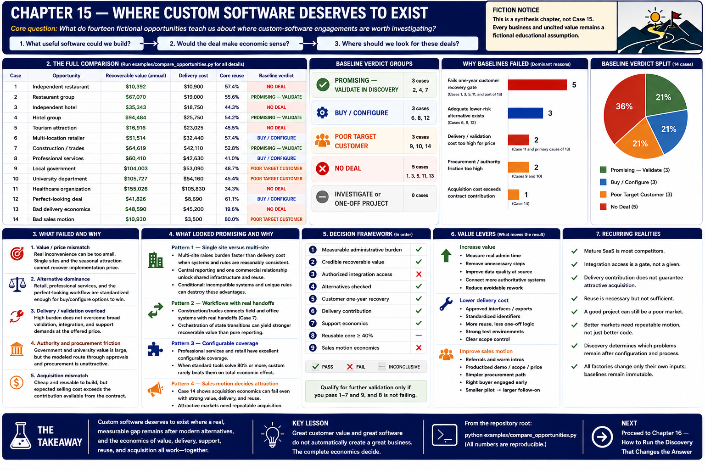

# Chapter 15 — Where Custom Software Deserves to Exist



> **Core question:** What do fourteen fictional opportunities teach us about where custom-software engagements are worth investigating?
>
> This is a synthesis chapter, **not Case 15**. Every business and uncited value remains a fictional educational assumption. The results generate hypotheses; they do not validate a market.

## 1. The experiment

Fourteen opportunities were evaluated through the same gates: meaningful and measurable burden, credible recoverable value, alternatives, authorized integration, customer and delivery economics, support, sales, and repeatability. The comparison uses each case's reusable baseline builder and framework-generated analysis. Case 12 correctly uses the final post-alternative scenario; Case 14 includes its transparent acquisition extension. Nothing is ranked by a weighted score.

```text
What useful software could we build?
        ↓
Would the deal make economic sense?
        ↓
Where should we look for these deals?
```

## 2. The full comparison

Run `python examples/compare_opportunities.py` for all numerical fields, support and sales tables, exact reasons, and deterministic verdict groups. This compact view is evidence for the discussion—not a league table.

| Case | Opportunity | Recoverable value | Delivery cost | Core reuse | Verdict |
|---:|---|---:|---:|---:|---|
| 1 | Independent restaurant | $10,392 | $10,900 | 57.4% | **NO DEAL** |
| 2 | Restaurant group | $67,070 | $19,000 | 55.6% | **PROMISING — VALIDATE IN DISCOVERY** |
| 3 | Independent hotel | $35,343 | $18,750 | 44.3% | **NO DEAL** |
| 4 | Hotel group | $94,484 | $25,750 | 54.2% | **PROMISING — VALIDATE IN DISCOVERY** |
| 5 | Tourism attraction | $16,916 | $23,025 | 45.5% | **NO DEAL** |
| 6 | Multi-location retailer | $51,514 | $32,440 | 57.4% | **BUY / CONFIGURE** |
| 7 | Construction / trades | $64,619 | $42,110 | 52.8% | **PROMISING — VALIDATE IN DISCOVERY** |
| 8 | Professional services | $60,410 | $42,630 | 41.0% | **BUY / CONFIGURE** |
| 9 | Local government | $104,003 | $53,090 | 48.7% | **POOR TARGET CUSTOMER** |
| 10 | University department | $105,727 | $54,160 | 45.4% | **POOR TARGET CUSTOMER** |
| 11 | Healthcare organization | $155,026 | $105,830 | 34.3% | **NO DEAL** |
| 12 | Perfect-looking deal | $41,826 | $8,690 | 61.1% | **BUY / CONFIGURE** |
| 13 | Bad delivery economics | $48,590 | $45,200 | 19.6% | **NO DEAL** |
| 14 | Bad sales motion | $10,930 | $3,500 | 80.0% | **POOR TARGET CUSTOMER** |

Baseline verdict groups are therefore:

- **PROMISING — VALIDATE IN DISCOVERY:** Cases 2, 4, and 7.
- **BUY / CONFIGURE:** Cases 6, 8, and 12.
- **POOR TARGET CUSTOMER:** Cases 9, 10, and 14.
- **NO DEAL:** Cases 1, 3, 5, 11, and 13.
- No baseline currently lands in **INVESTIGATE** or **ONE-OFF CUSTOM PROJECT**.

The dominant reasons are transparent. Cases 1, 3, 5, and 11 fail the one-year customer recovery gate. Case 13's price does not cover delivery plus solutions labor. Cases 6, 8, and 12 have adequate lower-risk alternatives. Cases 9 and 10 face institutional selling barriers; Case 14 instead has expected acquisition cost that overwhelms a small contract. Cases 2, 4, and 7 combine working value, delivery, support, and reuse assumptions—but remain discovery hypotheses.

## 3. What failed and why

Failure clusters by structure, not industry:

1. **Value/price mismatch.** A real inconvenience can still be too small. Single sites and the seasonal attraction cannot recover the implementation price within a year under their baselines.
2. **Alternative dominance.** Retail, professional services, and the perfect-looking field-service workflow are standardized enough for buy/configure options to win.
3. **Delivery/validation overload.** Healthcare's high burden does not overcome broad validation, integration, and support demands at the offered price. Case 13 isolates this provider-side failure.
4. **Authority and procurement friction.** Government and university value is large, but the modeled route through approvals and procurement is unattractive.
5. **Acquisition mismatch.** Case 14 is cheap and reusable to build, yet expected selling cost exceeds the contribution available from the contract.

A failed baseline does not prove an industry is bad. It says the modeled deal needs different evidence, scope, price, alternative, buyer, or sales motion.

## 4. What looked promising and why

### Pattern 1 — Single site versus multi-site

Cases 1/2 and 3/4 provide the cleanest contrasts. Recoverable value rises from $10,392 to $67,070 for the restaurant models while delivery cost rises from $10,900 to $19,000; in hotels it rises from $35,343 to $94,484 while delivery cost rises from $18,750 to $25,750. Shared infrastructure, one commercial relationship, central reporting, and incremental per-location work make Cases 2 and 4 pass where Cases 1 and 3 do not.

That relationship is conditional. If properties use incompatible systems, require unique rules, or lack central authority, customer-specific engineering and acceptance can scale nearly one-for-one with locations. “Multi-site” is therefore a discovery hypothesis about standardization, not a sufficient segment label.

### Pattern 2 — Reporting versus workflow handoffs

Restaurant, hotel, tourism, and retail cases mostly turn reconciliation/reporting burden into value. Some work at group scale; some remain insufficient; retail loses to SaaS. Construction/trades connects operational handoffs—estimate to job, field to office, purchasing, billing—where duplicate work, errors, and delay are modeled explicitly. It is promising, though costly.

The cases suggest that handoffs *may* reveal more recoverable consequences than reporting inconvenience, but they do not establish a universal advantage. Professional services has substantial handoff/admin value and still loses to configuration. The unresolved edge and alternative set matter as much as the label “workflow.”

### Pattern 3 — Standardization cuts both ways

Cases 6, 8, 12, and 14 show the tension:

```text
STANDARDIZATION → MORE TECHNICAL REUSE
STANDARDIZATION → STRONGER SaaS COMPETITION
```

Case 12 is the warning: an attractive, repeatable full-custom design becomes **BUY / CONFIGURE** after alternatives are investigated. Case 14 retains a cross-system edge but exposes a different trap: product-like code does not imply product-like acquisition. The most reusable technical problem may already be a product category.

### Pattern 4 — Bigger customer is not necessarily a better target

Restaurant and hotel groups add value faster than modeled delivery. Government and university add value alongside long cycles, procurement, governance, and split authority. Healthcare adds the most recoverable value, but also security, validation, integrations, support, and bespoke work. Size helps only when added value outruns *all* added friction.

### Pattern 5 — Authority matters

Case 10 makes four roles visible:

```text
PROBLEM OWNER ≠ BUDGET OWNER ≠ SYSTEM OWNER ≠ INTEGRATION APPROVER
```

A department champion cannot promise central-system access. Concentrated authority may make targets more executable, but that remains a hypothesis. Approved exports, central sponsorship, or a narrower boundary can sometimes redesign the opportunity without pretending governance away.

### Pattern 6 — Delivery risk is independent of customer value

Cases 7, 11, and 13 compare customer value with engineering complexity, validation, customer-specific work, uncertainty, and support. Case 7 narrowly works. Case 11 fails customer recovery despite very high theoretical value. Case 13 gives the customer strong economics but loses money for the provider. High value is necessary in many cases, never sufficient.

### Pattern 7 — Support is part of the product

Light read-only reporting and stable exports create different obligations from many changing APIs, consequential write workflows, privacy/security controls, and validation. The executable shows support cost next to annual fee. Case 13 leaves only $160 recurring contribution; healthcare's $38,000 fee supports $34,350 of direct recurring cost.

```text
RECURRING REVENUE ≠ RECURRING PROFIT
```

### Pattern 8 — Acquisition can destroy excellent implementation economics

Case 14 expects 140 selling hours per win and $9,100 acquisition cost for a $7,000 implementation. Its warm-referral scenario can be a good project while baseline outbound is a poor market motion. Case 9 differs: formal procurement itself is the barrier. Case 7 models manageable selling relative to contract value. Contract size must be compared with the effort and probability required to win it.

### Pattern 9 — The smallest useful intervention often wins

Across the cases, the strongest redesign is often to configure the existing product, build one narrow integration, consume approved exports, keep manual exceptions, or remove uncertain/high-effort scope. Integration-first does not mean “always integrate”; it means build only the unresolved edge after alternatives and authority are understood.

## 5. Good project versus good market

A **good project** works for one known customer at one price with one delivery path. A **good market hypothesis** additionally needs reachable similar buyers, repeatable qualification, scope, integration, acceptance, support, and acquisition.

- Case 14 can be a good referred project and a bad cold-outbound market.
- Cases 9 and 10 may contain valuable individual projects, yet institutional procurement limits repeatable pursuit.
- Case 13 could delight a customer while harming the provider.
- Cases 2, 4, and 7 are not “top three markets”; they are the baselines that survive every implemented gate.

**PROMISING means validate in discovery, not #1 market or proven demand.** Potential customer count, strategic fit, channel access, and actual variation remain unknown; no TAM, SAM, SOM, or market-growth claim is made here.

## 6. Integration patterns that repeat

Structural archetypes are more useful than industry labels, and a case need not fit only one:

- **Multi-unit integration:** Cases 2 and 4; central ownership plus partly shared systems and repeated reporting.
- **Operational handoff integration:** Case 7; expensive transitions among systems, people, and billing steps.
- **Mature SaaS category:** Cases 6, 8, and 12; common standardized needs with strong alternatives. Case 14 shares product-like engineering but retains a modeled unresolved cross-system edge.
- **Institutional friction:** Cases 9 and 10; high modeled value plus procurement, governance, and distributed authority.
- **High-value/high-complexity integration:** Cases 11 and 13; value cannot rescue validation/bespoke delivery economics.
- **Product-like engineering, weak acquisition:** Case 14; high code reuse with non-repeatable or expensive selling.
- **Small/seasonal reporting:** Cases 1, 3, and 5; useful work without enough baseline customer economics.

## 7. What reuse actually means

**Technical reuse** is shared adapters, schemas, validation, deployment, and monitoring. **Customer reuse** means the same pain, burden pattern, systems, permissions, and acceptance boundary recur. **Sales reuse** means the same ICP, buyer, discovery, demo, proposal, procurement path, and channel recur.

Cases 2 and 4 benefit from shared engineering inside one customer. Case 14 has 80% modeled core reuse but weak acquisition. Cases 9 and 10 have moderate technical reuse and unique governance work. Reusable code without reusable selling can make a library, not a market; reusable selling without stable delivery can sell unprofitable projects.

## 8. Why alternatives matter

Case 12 intentionally changes its conclusion after alternative discovery. The relevant comparison is not custom versus doing nothing, but full custom versus configure, process change, automation, narrow edge, and doing nothing. Cases 6 and 8 reinforce that conclusion. Discovery should ask what remains unresolved *after* the best existing product is configured—not whether custom can reproduce its category.

## 9. Why delivery economics matter

Case 13 shows the price corridor explicitly. Customer value and payback work, but $20,000 implementation revenue cannot cover $45,200 direct delivery plus solutions labor. Raising price alone can cross the customer's rational maximum. Better access, reduced scope, reusable adapters, or paid discovery are possible redesigns; optimism is not one.

## 10. Why sales economics matter

Case 14 separates delivery contribution from expected acquisition cost. A warm introduction, partner channel, larger contract, or productized motion changes the denominator. Higher engineering reuse alone does not. Cases 9 and 10 add a separate lesson: long/formal procurement is not identical to routine outbound inefficiency, though both consume scarce solutions capacity.

## 11. Discovery hypotheses

These fictional cases produce the strongest hypotheses for discovery—not validated markets.

### Hypothesis 1 — Standardized multi-unit operators

1. **Investigate:** modest groups with common ownership, shared systems, and central reporting/workflow burden.
2. **Why interesting:** Cases 2 and 4 model value growing faster than shared architecture and selling effort.
3. **Assumptions doing work:** genuine central burden, common data, one sponsor, modest per-unit exceptions.
4. **Falsify quickly if:** a group SaaS module already resolves it, systems vary heavily, or central labor is small.
5. **Ask:** How many locations? Which systems differ? What is reconciled centrally? Who can authorize every connection?

### Hypothesis 2 — Measurable operational handoffs

1. **Investigate:** businesses where existing systems leave duplicate entry, rework, and billing/fulfilment delays between teams.
2. **Why interesting:** Case 7 converts handoff consequences into recoverable value and survives delivery/support gates.
3. **Assumptions doing work:** reliable burden measurement, supported interfaces, bounded write risk, stable workflow.
4. **Falsify quickly if:** the incumbent suite/configuration closes the gap or exceptions dominate the process.
5. **Ask:** Where does data change hands? How often? What errors/delays follow? Which step should remain manual?

### Hypothesis 3 — Narrow authorized edges

1. **Investigate:** organizations able to approve exports or limited integrations where a configured product leaves one valuable gap.
2. **Why interesting:** narrow boundaries can avoid replacement cost, validation, and ongoing support exposure.
3. **Assumptions doing work:** legitimate access, stable schema, contained consequences, sufficient residual value.
4. **Falsify quickly if:** access is prohibited, residual burden is immaterial, or vendor roadmap/configuration solves it.
5. **Ask:** What remains after configuration? Can an approved export suffice? What is the smallest safe intervention?

### Hypothesis 4 — Channel-accessible repeatable buyers

1. **Investigate:** recurring technical patterns reachable through referrals, associations, incumbent vendors, or partners.
2. **Why interesting:** Case 14's delivery works when acquisition effort falls; sales reuse can unlock engineering reuse.
3. **Assumptions doing work:** credible channel, qualified close rate, common buyer, standardized offer/onboarding.
4. **Falsify quickly if:** every account needs custom education, committees, unpaid design, or a different buyer.
5. **Ask:** How are similar tools bought? Who already has trust? How many hours precede a qualified yes/no?

### Patterns to deprioritize unless evidence changes

- Tiny or seasonal single-site burdens that cannot support price and support.
- Mature SaaS categories where little valuable edge remains after configuration.
- Broad, bespoke or high-validation integrations without a feasible price corridor.
- Small contracts requiring expensive outbound, committee selling, or prolonged acceptance.
- Champions without budget, system/data ownership, or integration approval.

## 12. Screening checklist

Use this in discovery as a conversation guide, **not a scored rubric**:

1. Is the problem economically meaningful?
2. Is the burden measurable?
3. What part is realistically recoverable?
4. Which existing product already solves it?
5. What remains unresolved after configuration?
6. Who owns the workflow?
7. Who owns the budget?
8. Who owns the systems and data?
9. Is integration access realistic and authorized?
10. What is the smallest useful intervention?
11. How many engineering hours does it require?
12. How much engineering is reusable?
13. How much work is customer-specific?
14. What support obligation does it create?
15. What can the customer rationally pay?
16. What is the provider's sustainable minimum price?
17. Is there a feasible price corridor?
18. How many solutions and sales hours are required?
19. What is expected acquisition cost per win?
20. Does the problem repeat across reachable customers?
21. Does the sales motion repeat?
22. Is this a good project, a good market hypothesis, both, or neither?
23. Which assumption should discovery test first?
24. Should we build, buy/configure, investigate, redesign, or pass?

### Transparent opportunity funnel

```text
MEANINGFUL PROBLEM?
├── NO → PASS / NO DEAL
└── YES
    ↓
MEASURABLE BURDEN + RECOVERABLE VALUE?
├── NO → INVESTIGATE
└── YES
    ↓
ADEQUATE EXISTING ALTERNATIVE?
├── YES → BUY / CONFIGURE
└── NO
    ↓
AUTHORIZED + FEASIBLE INTEGRATION?
├── UNKNOWN → INVESTIGATE
├── NO → REDESIGN / NO DEAL
└── YES
    ↓
DELIVERY + SOLUTIONS ECONOMICS WORK?
├── NO → REDESIGN / NO DEAL
└── YES
    ↓
CUSTOMER ECONOMICS WORK?
├── NO → NO DEAL
└── YES
    ↓
SUPPORT SUSTAINABLE?
├── NO → REDESIGN / NO DEAL
└── YES
    ↓
SALES / ACQUISITION ECONOMICS WORK?
├── NO → POOR TARGET CUSTOMER
└── YES
    ↓
REPEATABILITY?
├── LOW → ONE-OFF CUSTOM PROJECT
└── HIGH → PROMISING — VALIDATE IN DISCOVERY
```

This follows the framework's gate order. An infeasible integration is **NO DEAL**; missing evidence is **INVESTIGATE**; low core reuse after viable economics is **ONE-OFF**. Procurement and acquisition extensions can make an otherwise viable deal a **POOR TARGET**.

## 13. From fictional case to real customer

The casebook narrows where to learn; it cannot replace learning:

```text
CASEBOOK
   ↓
Economic hypothesis
   ↓
Target customer profile
   ↓
Real discovery
   ↓
Actual burden
   ↓
Actual alternatives
   ↓
Actual integration constraints
   ↓
Recalculate
   ↓
Prototype only if justified
```

The best custom-software market is not necessarily the industry with the most businesses, largest organizations, or biggest theoretical problems. The hypothesis worth testing lies where meaningful unresolved problems, measurable value, insufficient alternatives, authorized reachable buyers, feasible integration, sustainable delivery and support, efficient sales, and repeatable engineering intersect.

Even there, **PROMISING = VALIDATE IN DISCOVERY**, not **PROVEN MARKET**.

The goal is not to prove that custom software should be sold. The goal is to learn where custom software deserves to exist.

---

[← Previous: Case 14 — Great Product, Bad Sales Motion](14-bad-sales-motion.md) · [Book home](../README.md)
